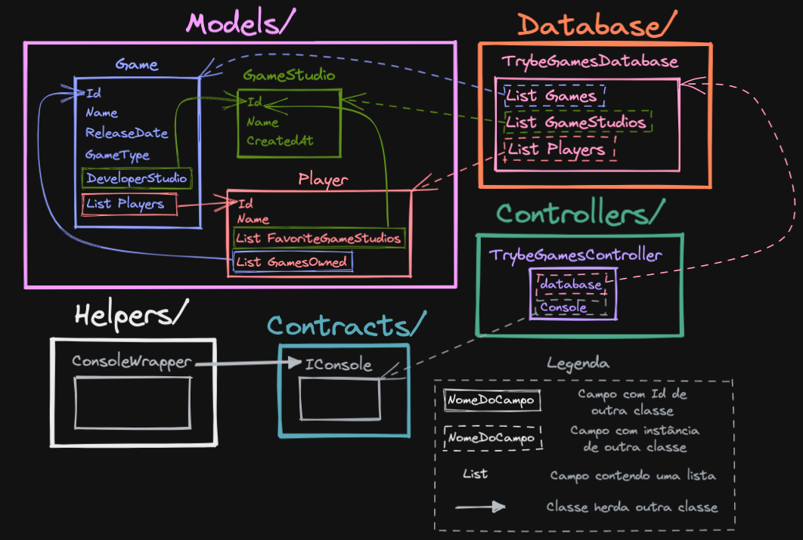

# Trybe Games

Boas-vindas ao repositório do projeto `Trybe Games`

Nesse projeto foi desenvolvido uma *Console Aplication* que gerencia e armazena dados de jogos jogados por Trybers (pessoas estudantes da Trybe), utilizando consultas [**LINQ**](https://learn.microsoft.com/pt-br/dotnet/csharp/linq) do .NET para retornar dados de coleções presentes no sistema.

Desenvolvido durante o período de **Aceleração C#** da Trybe 🚀

Tem por objetivo a avaliação e prática dos conhecimentos adquiridos durante a aceleração, visando o cumprimento do requisitos solicitados!

## Divisão

Este sistema está dividido em diretórios específicos, para que fique mais fácil de entender e separar as entidades.
 - `Contracts/` Estão armazenadas as `interfaces` que uma classe pode implementar.
 - `Controller/` Estão armazenados os controllers responsáveis por realizar alguma ação que interage com a pessoa usuária e o banco de dados. No caso dessa aplicação há apenas um _controller_.
 - `Database/` Está armazenada a classe que representa o banco de dados do sistema. Essa classe contém uma lista de cada um dos modelos presentes no sistema e alguns métodos que podem ser utilizados para fazer consultas a essas listas e a relações entre elas.
 - `Models/` Contém os Modelos do sistema, no caso três: `Game`, `Player`, `GameStudio`.

O arquivo `Program.cs` utiliza a classe `TrybeGamesController` para executar as ações com a pessoa usuária.

Entretando, para entender melhor a relação entre os Models `Game`, `Player` e `GameStudio` veja o diagrama abaixo:


Perceba que cada `Game` possui duas relações com `Player`:
 1. Um jogo `Game` pode ter várias pessoas jogadoras `Player` utilizando para isso o membro `Game.Players`, que é uma lista do tipo inteiro e armazena os Ids das pessoas jogadoras.
 2. Uma pessoa jogadora `Player` pode ter vários jogos `Game` comprados utilizando para isso o membro `Player.GamesOwned`, que é uma lista do tipo inteiro e armazena os Ids dos jogos comprados.

`GameStudio`, por sua vez, se relaciona apenas com `Game`. Cada `Game` é desenvolvido por um `GameStudio` e é utilizado o campo `Game.DeveloperStudio`, que é do tipo inteiro e armazena o Id do studio desenvolvedor do jogo.

`Player` também pode ter uma lista de estúdios favoritos. Para isso é utilizado o seu membro `Player.FavoriteGameStudios`, que é uma lista do tipo inteiro que armazena os Ids dos estúdios favoritos.

Esses Models, por sua vez, são utilizados na classe `TrybeGamesDatabse` para compor o banco de dados. E `TrybeGamesDatabase` é utilizado em `TrybeGamesController` para realizar as consultas e operações requisitadas pela pessoa usuária. Veja no diagrama completo abaixo todas as relações entre cada entidade do sistema.



## Uso no Docker 🐋
Se você possuir o [Docker](https://www.docker.com) e o [Docker compose](https://docs.docker.com/compose/install) instalados, você pode economizar muito trabalho na configuração do ambiente de produção.

Para iniciar a aplicação no ambiente Docker, basta executar 1 comando:
```
docker-compose -f docker-compose.prod.yml up -d
```

Assim que os containers estiverem funcionando, a aplicação poderá ser executada no container `trybe-games` com o comando:
```
dotnet TrybeGames.dll
```

## Instalação e Uso 🖥️
⚠️ É necessário ter instalado o [.NET Framework](https://dotnet.microsoft.com/pt-br) (Windows) ou [.NET Core](https://dotnet.microsoft.com/pt-br/) (Linux/ Mac) em sua máquina para executar o sistema.

**Na raiz do projeto execute os comandos abaixo no seu terminal:**

1. Instale as dependências
```
dotnet restore ./src
```

2. Execute a aplicação
```
dotnet run --project ./src/TrybeGames/TrybeGames.csproj
```

## Desenvolvimento 🧑‍💻
Para desenvolver novos recursos ou refatorar é recomendado o uso do [Docker](https://www.docker.com) e do [Docker compose](https://docs.docker.com/compose/install), pois eles fornecem um ambiente isolado e devidamente configurado no arquivo `docker-compose.dev.yml`.

⚠️ É necessário ter o [Git](https://git-scm.com) instalado em sua máquina para o controle de versão do sistema.

**Na raiz do projeto execute os comandos abaixo no seu terminal:**
1. Crie e entre em uma nova *branch* de desenvolvimento
```
git checkout -b nome-da-branch
```

2. Crie o ambiente Docker de desenvolvimento
```
docker-compose -f docker-compose.dev.yml up -d
```

Após esse processo a aplicação estará pronta para o desenvolvimento e disponível para ser executada no container `dev_trybe-games` com o comando:
```
dotnet run
```

3. Veja a execução dos testes no log do container `test_trybe-games` ou dos testes de avaliação dos requisitos no log do container `evaluator-test_trybe-games`. Também é possivel executar testes específicos em cada container com o comando `dotnet test` junto do parâmetro `--filter`, veja alguns exemplos no arquivo `Makefile`.

Para adicionar as alterações da nova branch de desenvolvimento na branch principal ```main``` é nescessário criar um *Pull Request* neste repositório.

Alterações diretas na branch ```main``` estão bloqueadas.

⚠️ NOTA: O uso dos comandos `make` listados no arquivo `Makefile` é recomendado para acelerar o processo de criação e remoção dos containers dev e/ou produção ou na execução de scripts `dotnet` no caso de não usar o docker como ambiente de desenvolvimento.

## Contribuidores 🤝

- [THIAGO MARTINS](https://github.com/thiagomartins367) - criador e mantenedor
